# Evidencia 4: Red de Referencias Bibliográficas

Este diagrama representa la interconexión de las referencias clave identificadas en la revisión sistemática de literatura (2020-2025), categorizadas por su enfoque metodológico en el control de trayectorias para escáneres de obleas.

```mermaid
graph TD
    %% Categories
    IS[Input Shaping]
    CS[Sincronización de Cadenas]
    AC[Control Adaptable]
    NN[Redes Neuronales]
    DC[Control Basado en Datos]
    PM[Modelado Predictivo]

    %% Foundation
    Found[Fundamentos Teóricos] --> IS
    Found --> CS
    Found --> PM

    %% Input Shaping Papers
    IS --> AlRawashdeh2023a[Al-Rawashdeh et al. 2023a: Kinodynamic Generation]
    IS --> AlRawashdeh2023b[Al-Rawashdeh et al. 2023b: Motion Orchestration]
    IS --> Heertjes2023_CDC[Heertjes et al. 2023: Fourth-Order Trajectories]

    %% Chain Synchronization Papers
    CS --> AlRawashdeh2021[Al-Rawashdeh et al. 2021: Open-Chain Sync]
    CS --> Li2020[Li et al. 2020: Phase Compensation]

    %% Adaptive Control Papers
    AC --> Kuang2021[Kuang et al. 2021: Fractional-Order Super-Twisting]

    %% Neural Networks Papers
    NN --> Kuang2020[Kuang et al. 2020: RBF Neural Networks]

    %% Data-based Control Papers
    DC --> AlRawashdeh2024[Al-Rawashdeh et al. 2024: Model-Free Control]
    DC --> Liu2024[Liu et al. 2024: Dynamic Decoupling]
    DC --> Sun2024[Sun et al. 2024: Iterative Learning Control]

    %% Predictive Modeling Papers
    PM --> Chen2023[Chen et al. 2023: Feedforward Prediction]
    PM --> Subramanian2024[Subramanian et al. 2024: Switching Predictive Models]

    %% Styles
    style Found fill:#f9f,stroke:#333,stroke-width:2px
    style IS fill:#d5f5e3,stroke:#27ae60
    style CS fill:#d5f5e3,stroke:#27ae60
    style AC fill:#fff3cd,stroke:#f0ad4e
    style NN fill:#fff3cd,stroke:#f0ad4e
    style DC fill:#fde8e8,stroke:#c0392b
    style PM fill:#fde8e8,stroke:#c0392b
```

### Resumen de Categorías
- **Input Shaping:** Enfocado en la reducción de vibraciones mediante perfiles de movimiento de alto orden.
- **Control Basado en Datos:** Métodos que omiten el modelado físico en favor de la identificación en línea.
- **Modelado Predictivo:** Uso de gemelos digitales y modelos térmicos para anticipar errores de posicionamiento.
